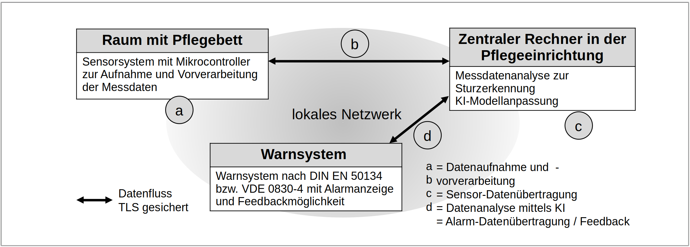

# Optimization (Tuning) of an AI for Fall Detection from Beds
## Team : 
Ankita Shah (11152527), Sneha Khirwal (11153677), Yash Pisat (11154565)

## a. Assignment:

Falls by patients are a major source of danger.
Falls often take place near the care bed, for example due to circulatory fluctuations after getting up.
Immediate detection of falls allows caregivers to react quickly, reducing short-term suffering and long-term health effects.
The aim of the project is therefore to develop a cost-effective and efficient means of detecting falls.
This system is intended to quickly detect falls and notify the nursing staff.
At the same time, it should be data-efficient and thus, for example, manage without the use of portable sensors or video surveillance.
The developed system is integrated into care beds.
It absorbs mechanical vibrations that are transmitted through the bed frame.
This requires both sensitive electronics and a way of separating vibration patterns from falls from other patterns as clearly as possible.
To solve this challenge, well-designed experiments will identify meaningful data samples that will be used to train modern AI models for fall detection.
We implement an innovative AI-based approach to detect and classify falls from beds.
The AI architecture of the system processes real-time data from sensors in a complex, varying environment.
A basic ML/AI solution (Deep Learning, Machine Learning) for classification and fall detection will be available.
Using the tools that were taught in the ML/AI lectures, your goal is to analyze, test and optimize (tune) the existing AI solution.

The project involves the following steps:
* The participants get to know the existing (basic) deep-learning AI solution.
This also involves understanding of the application, related events, data
structure, and relevant input parameters of the AI.
* The existing, simple AI architecture should be analyzed and optimized
(tuned). The AI should be able to handle different behavior patterns.
* Results will be evaluated in the real-world setting.

## b. What do you learn?

* Programming in a state-of-the-art scientific computing programming language
* Integration of Deep Learning and AI approaches in a real-world setting
* Practical insights into AI, deep learning and optimization methods
* Hyperparameter optimization with SPOT and related algorithms for real-world scenarios
* Dealing with a practical optimization problem from healthcare
* Scientific project documentation
* Working in teams

## c. Requirements

* Experience in programming with R, python
* Scientific working and writing
* Interest in the application of artificial intelligence methods
* Knowledge introduced in ML/AI lectures

## d. Project Partners:

* Several teams from TH Köln (IDE+A and other institutes)
* Partner from industry (TekVor Care GmbH)

## e. Tutors:

Prof. Dr. T. Bartz-Beielstein, Sowmya Chandrasekaran, IDE+A Team

## f. Duration:

Case study can be prepared during the summer months.
If you like, you can attend internal meetings of the corresponding research project (voluntarily).
You can form subgroups (two or three students) in order to modularize the tasks.

### Meetings 

| Date, Time | Location           | Content | Material | Task |
| ---------- | --------           | ------- | -------- | ---- |
|25.10.2022 | On-site: Room 0503  | Kick-off Meeting. Prof. Bartz-Beielstein, Konstantin Dietrich: Intro | [notebook 1](./Notebooks/1.%20Logisitc%20Regression.ipynb), [notebook 2](./Notebooks/2.%20Classificator.ipynb)| Work with notebooks 1+2, Read paper about augmentation, see References.
| 1.11.2022  | No Meeting (Allerheiligen) |         |          |
| 8.11.2022  | On-site: Room 0503 |         |          |

## g. References:

* Augmentation
    * [Data Augmentation Overview](./Literature/DataAugmentationTechniquesInTimeSeriesDomain.pdf)
    * [Data Augmentation Using VAE](./Literature/alha19a.pdf)

* ML/AI Lecture notes Prof. Bartz-Beielstein (2021).
* Bartz et al.: *Hyperparameter Tuning for Machine and Deep Learning with R - A Practical Guide*, Springer 2022
